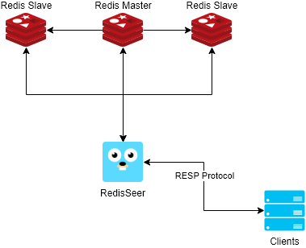

# RedisSeer

<div style="text-align:center"></div>

  [](https://travis-ci.com/bvisonl/redis-seer) 

A standalone Redis proxy with keepalive and master failover support.

> :warning: This is currently just a proof of concept and it came up from an exercise I wanted to do because I was not able to find a simple Redis proxy/HA that worked for standalone environments that supported both balancing and failover (like how AWS ElastiCache works). I am pretty sure that additional impact in performance will show up when performing benchmarks but if it's something tolerable then I might consider using this in production for non-cluster and non-sentinel environments.

<div style="text-align:center"></div>

## Requirements :clipboard:

* `Go` if you want to build the project from source (otherwise download one of the releases)


## Installation :construction:
```go
# Download from the repository
git clone https://github.com/bvison/redis-seer.git
cd redis-seer
go build
```

You should see a `redis-seer` binary inside the folder

## Configuration :customs:

`redis-seer` feeds its configuration from a YAML file  that. This is a full sample configuration:

```yaml
debug: true
port: 5100
selectionMode: "random" # round-robin, random, load
readSlaveOnly: true
enableFailover: true
monitorInterval: 1
db: 0
servers:
  redis1:
    enabled: true
    alias: redis1
    host: "127.0.0.1"
    port: 7000
  redis2:
    enabled: true
    alias: redis2
    host: "127.0.0.1"
    port: 7001
  redis3:
    enabled: true
    alias: redis3
    host: "127.0.0.1"
    port: 7002
```

As you can see things like database selection and authentication should be configured here and not in the real client.

Some parameters that may need explanation:

* **port:** Port on which `RedisSeer` will listen for requests.

* **readSlaveOnly:** This will avoid sending commands such as `GET` to the current master.

* **enableFailover:** Setting this to true will trigger a failover process when the master fails.

* **monitorInterval:** The interval on which the servers will be contacted for things like: checking the master, pinging the slaves, and also reconnecting when a connection drops.

* **db:** Database to use when connecting to the redis servers. As of right now if multiple databases are needed additional instances of `RedisSeer` with different configuration files should be deployed.

* **selectionMode:** The selection process to be used when picking a server to send the command to.
    * **round-robin**: Typical round-robin method, the servers will be selected in a sequential way.
    * **random** *(default)*: A random server will be picked from the list.
    * **load**: The proxy will keep note on the load sent to the server and will pick the least targeted server.


## Usage :arrow_forward:

**On Linux**:
```bash
$ ./redis-seer -c config.yml
```
**On Windows**:
```bash
$ redis-seer.exe -c config.yml
```

Some flags that can be used:

* **-c**: Specify the configuration file to use
* **-d**: Enable additional debugging output

## Example :electric_plug:

Inside the `tests/redis` folder there is a `docker-compose.yml` file that boots up 3 redis instances to be used with the tests and if you want to you can test `redis-seer` with them.

**Run Redis servers**
```bash
cd tests/redis
docker-compose up -d

# Run docker ps to confirm that the servers are up and running
```

Also, inside `tests/` there is a `config.yml` with the sample configuration to be used with this `docker-compose.yml`. If needed, modify it at will or point the parameter to the correct `yml` file.


**Run RedisSeer**
```bash
./redis-seer -c tests/config.yml
```

## TODO :wrench:
* Ability to disable failover (things like AWS ElastiCache have the SLAVEOF command blocked.)
* Add more configuration options (i.e. authentication)
* Add Makefile
* Add an API
* Docker deployment & Build
* Implement selection method
* Add Master monitoring and failover process
* Add config file as an argument
* Organize code structure
* Make use of channels to improve communication
* Improve error handling
* Handle connection changes more appropriately
* Add tests
* Run benchmarks
* Ansible deployment

## Contribution :construction_worker:

TBD.
